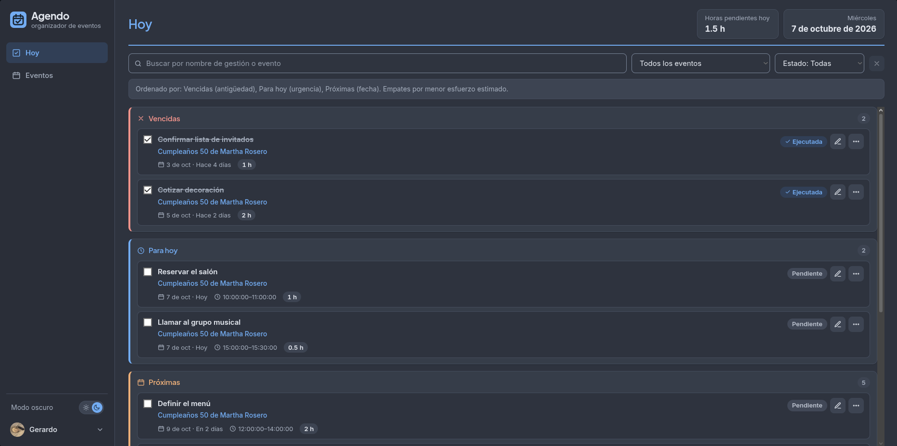
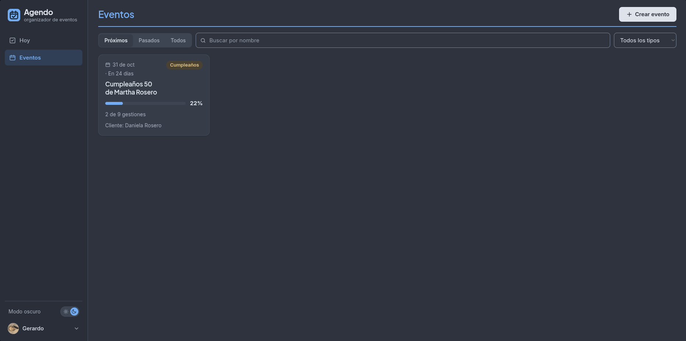

# Agendo — Frontend

Interfaz web de **Agendo**, un organizador de eventos independientes: cada usuario crea sus eventos, lleva el control de las gestiones (tareas) que necesita para sacarlos adelante y, en la vista **Hoy**, ve de un vistazo lo vencido, lo de hoy y lo próximo.

Proyecto del Miniproyecto 1 de Proyecto Integrador I (Universidad del Valle), desarrollado en equipo por sprints.

**Demo:** https://mini-proyecto-1-pi-1.inmemorialake.dev · **Backend:** [Miniproyecto-1-PI-1/BackEnd](https://github.com/Miniproyecto-1-PI-1/BackEnd)

Para probarla sin registrarte: `valentina@eventosvv.co` / `valentina123`.

> **Nota:** el backend está desplegado en el plan gratuito de Render, que se suspende tras un rato sin tráfico. Si el inicio de sesión tarda en la primera carga, espera cerca de un minuto mientras el servidor arranca; después la app responde con normalidad.





## Funcionalidades

- **Cuenta:** registro, inicio de sesión con JWT, sesión persistente y cierre automático si el token vence.
- **Eventos:** crear, editar, eliminar y buscar eventos, con tipo de evento y progreso según sus gestiones.
- **Gestiones:** crear, editar, eliminar y marcar como ejecutadas, con fecha límite y horas estimadas.
- **Hoy:** gestiones vencidas, de hoy y próximas de todos los eventos, con filtros, búsqueda y acciones rápidas.
- **Configuración:** foto de perfil (recortada a 256×256 en el navegador), datos personales, cambio de contraseña y eliminación de cuenta.
- **Tema claro y oscuro:** sigue la preferencia del sistema la primera vez y se cambia desde el sidebar o el login.

## Stack

| Capa | Tecnología |
| --- | --- |
| UI | React 19 |
| Build | Vite 8 |
| Enrutamiento | React Router 7 |
| Estilos | Tailwind CSS 4 y CSS Modules, con tokens de color en `src/styles/tokens.css` |
| Linting | oxlint |
| Despliegue | Vercel |

## Estructura

```
src/
├── api/          Cliente HTTP hacia el backend
├── components/   Componentes reutilizables
├── context/      Contexto de sesión (AuthContext)
├── hooks/        Hooks propios (sesión, tema, peticiones, cambios sin guardar)
├── pages/        Vistas de cada ruta, con estilos en CSS Modules
├── styles/       Estilos globales y tokens de color
├── utils/        Funciones auxiliares
└── data/         Catálogos estáticos (tipos de evento)
```

## Puesta en marcha

Requisitos: Node.js y el [backend](https://github.com/Miniproyecto-1-PI-1/BackEnd) corriendo (en local o el desplegado).

```bash
npm install
cp .env.example .env   # ajusta VITE_API_URL si el backend no está en localhost:8080
npm run dev
```

| Script | Qué hace |
| --- | --- |
| `npm run dev` | Servidor de desarrollo en http://localhost:5173 |
| `npm run build` | Build de producción en `dist/` |
| `npm run preview` | Sirve el build localmente |
| `npm run lint` | Revisa el código con oxlint |

## Variables de entorno

| Variable | Descripción |
| --- | --- |
| `VITE_API_URL` | URL del backend Spring Boot, por ejemplo `http://localhost:8080` |

## Equipo

| Integrante | GitHub |
| --- | --- |
| Andrés Gerardo González Rosero | [@Inmemorialake](https://github.com/Inmemorialake) |
| Victoria Yuan Chen | [@ycvictoria](https://github.com/ycvictoria) |
| Freddy Alexander Melo Buitrago | [@Alexander-Motion](https://github.com/Alexander-Motion) |
| Andrés Felipe Narváez Bolaños | [@andres042](https://github.com/andres042) |